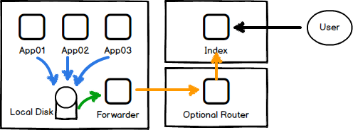

#  Mg

Mg is the periodic symbol for Magnesium an element that is often found in tracer rounds. This project is derived from the details provided in the Google Dapper paper.

The primary goals for this project are:

  - minimise external operational dependencies.
  - provide simple libraries that can easily be integrated into existing projects.
  - maximise the number of supported languages.

## Architecture



## Binary Log Format

| TraceId | SpanParentId | SpanId  | Requested | Completed | Source | Dest   | Req Sz | Resp Sz | Span Len | Checksum | Name   | Annotations  |
|---------|--------------|---------|-----------|-----------|--------|--------|--------|---------|----------|----------|--------|--------------|
| uint64  | uint32       | uint32  | int64     | int64     | int128 | int128 | int64  | int64   | uint64   | int16    | string | []annotation |

## Wire Format

The wireformat aims to be as minimal as possible. 16 bytes for binary and 38 bytes with the header and line termination for HTTP. The data is broken up in the following way:

|        | TraceId | SpanParentId | SpanId  |
|--------|---------|--------------|---------|
| Binary | uint64  | uint32       | uint32  |
| Text   | base64(Binary) | -     | -       |

This format is more compact than Zipkins spanning a mere 128bits in binary form. Sampling is decided by the edge service that receives the initiating request. For the initiating request child span id's are incremented by 1. All other span id's are generated by incrementing the parent id by 2.

### HTTP Header

The HTTP header X-Mg-Trace has 3 potential states:

  - "-" indicating do not trace.
  - "P" indicating persist the trace independent of sampling.
  - "${Base64}" indicating associate this request with this trace span.

Example:
```
// don't trace this message, must be forwarded to all call-points.
X-Mg-Trace: -

// force persisting of this trace (only valid for edge nodes).
X-Mg-Trace: P
// timestamp
X-Mg-Timestamp: 1444542668000
// Associated User Id
X-Mg-Trace-Uid: 12345
// base64(sha256(uid+token+timestamp))
X-Mg-Trace-Sig: ZTNiMGM0NDI5OGZjMWMxNDlhZmJmNGM4OTk2ZmI5MjQyN2FlNDFlNDY0OWI5MzRjYTQ5NTk5MWI3ODUyYjg1NQ==

// packed base64(TraceId+SpanParentId+SpanId)
X-Mg-Trace: MDEyMzQ1Njc4OUFCQ0RFMA==
```
### Avro RPC

